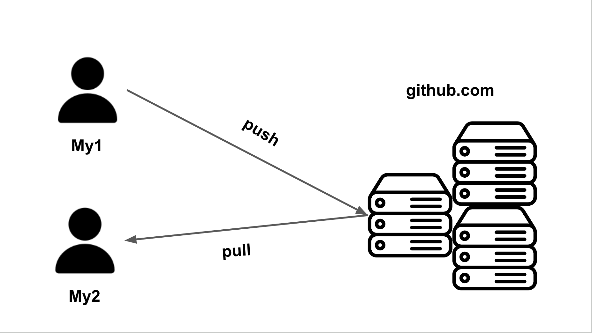
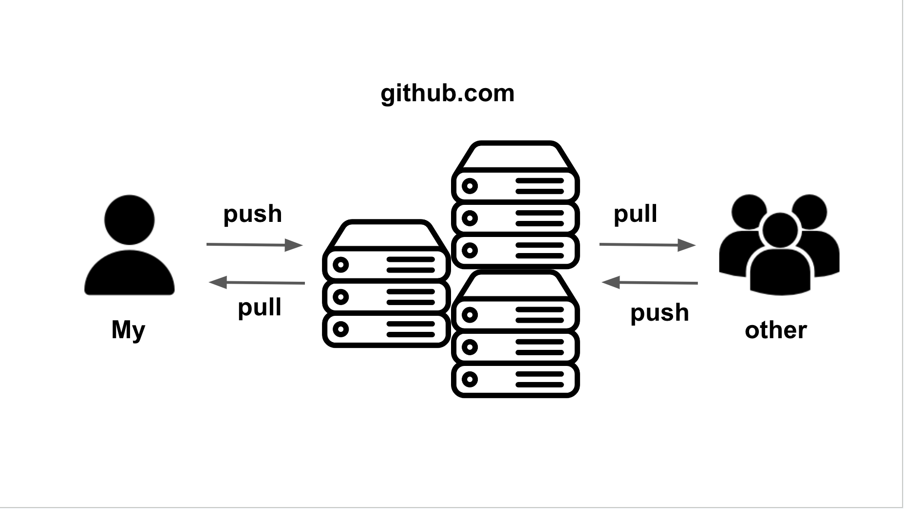
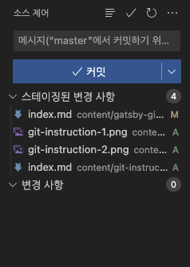
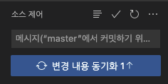
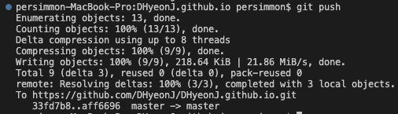
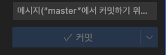

## Git이란

✔️ 2005년에 리눅스 운영체제 개발자인 리눅스 토르발츠가 리눅스 소스코드를 잘 관리하기 위해 Git를 개발하였다. 현재는 리눅스 뿐만 아니라 다양한 언어 소스코드를 관리되고 있다.

## Git의 3대 목적

✔️ Git은 3대 목적으로 `Version(버전관리)`,`Backup(백업)`,`Collaborate(협업)`이 있다.

### 1️. Version(버전관리)

✔️ `Git를 사용하지 않고 버전관리`,`Git를 사용한 버전관리` 2가지로 다시 나눌 수 있다.

  1️⃣ `Git를 사용하지 않고 버전관리`
  - 파일을 수정할 때마다 파일을 생성해야 한다.
  - 필요할 때마다 부분으로 돌아갈 수 없다.
  - 파일이 한 개가 아닌 여러 개로 관리된다.
  
  2️⃣ `Git를 사용한 버전 관리`
  - 변경 사항 있어도 파일 한 개로 관리할 수 있다.
  - 변경사항 추적을 할 수 있어서 원하는 버전으로 돌아갈 수 있다.

### 2. Backup(백업)

✔️ My1 컴퓨터에서 소스코드를 수정하고나서 `push`를 통해 GitHub에 올리면 다른 My2 컴퓨터에서 `pull`를 통해 수정한 소스를 받을 수 있다.



### 3. Collaborate(협업)

✔️ 내가 맡은 부분을 My 컴퓨터에서 소스를 수정하고 `push`를 통해 GitHub에 올리면 협업자가 `pull`를 통해 내가 수정한 부분을 other 컴퓨터에서 내려 받을 수 있고,
반대로 협업자가 맡은 부분을 other 컴퓨터에서 소스를 수정하고 `push`를 통해 GitHub에 올리면 내가 `pull`를 통해 My 컴퓨터에 반영할 수 있다.



## Git과 GitHUB의 연관성

✔️ Git과 GitHub는 비슷해 보이지만 연관성이 있지만 서로 다른 개념이다.

  1️⃣ `Git(깃)`
  - 로컬에서 관리되는 버전관리시스템이다.
  - 직접 소스코드를 수정함으로써 버전관리를 한다.
  - 소스코드를 효율적으로 관리할 수 있게 해주는 형상관리 도구이다.
  
  2️⃣ `GitHub`
  - Git을 사용하는 프로젝트를 지원
  - 개발자들이 협업 및 버전 제어를 위한 하나의 플랫폼
  - 클라우드를 통해 관리되는 버전관리시스템
  - 깃처럼 자체적으로 구축하는 시스템이 아닌 클라우드를 빌려쓰는 개념이다.

  ▶︎ `Git` :  로컬에서 관리되는 버전 관리 시스템이라 혼자 작업을 하거나 작은 단위 프로젝트일 경우에 사용한다.
  <br>
  ▶︎ `GitHub` : 개발자간의 소스를 공유하거나 큰 단위 프로젝트를 할 때 GitHub에서 제공하는 클라우드 서비스를 이용한다.

## Git 주요개념

✔️ Git을 사용할 때 필요한 주요 개념을 알아보자

1️⃣ Repository (저장소) : 소스 코드들이 저장되어 있는 물리적인 공간을 의미한다. 저장소를 통해서 작업자가 진행, 변경했던 사항들에 대해 버전 별로 확인할 수 있다.
작업을 시작할 때 원격 저장소에서 로컬 저장소로 소스 코드를 복사해서 가져오고(Clone), 이후 소스 코드를 변경한 다음 커밋(Commit)한다. 이 때, 커밋한 소스는 로컬 저장소에 저장되며, Push 하기 전에는 원격 저장소에 반영되지 않는다.

2️⃣ Working Tree : 우리가 사용하는 '폴더'를 말한다.

3️⃣ Index (= Staging Area) : Commit을 실행하기 전의 저장소와 Working tree 사이에 존재하는 공간을 말한다. Working Tree -> Index -> Commit 순의 절차를 거친다.

4️⃣ Commit : 작업 과정들에 대한 점검을 마친 뒤, 저장소에 남기는 과정을 의미한다. 각각의 커밋 단계는 의미 있는 단계이다. 따라서 커밋 로그를 남긴다. git log라는 명령어를 통해 커밋된 사항들에 대해 확인 할 수 있다.

5️⃣ Checkout : 특정 시점이나 branch의 소스 코드로 이동하는 것을 의미한다. 이 과정을 통해 과거 여러 시점의 소스 코드로 이동할 수 있다.

6️⃣ Branch : Commit 단위로 구분된 소스 코드 타임라인에서 분기해서 새로운 commit을 쌓을 수 있는 가지를 만드는 것을 말한다. Branch에서 작업을 완료하면, Merge 작업을 수행한다.

7️⃣ Merge : Branch와 Branch의 내용을 합치는 작업, 즉 병합을 말한다. Branch와는 다소 반대되는 개념이다. 병합 과정 중 두 branch에서 하나의 동일한 파일에서 서로 다른게 수정한 경우 충돌이 발생하며, 병합이 일시정지 된다. 이 때, 충돌 부분에 대해 직접 수정하거나 Merge Tool 등을 활용하여 충돌을 해결한 뒤 병합을 계속 진행한다.


## Git 명령어

✔️ 소스코드를 관리할 때 사용되는 명령어들을 알아보자.

- git init : 깃 초기화. 이 명령어를 실행해야만 깃이 실행된다. 이 명령어 실행 전까지는 그냥 일반 폴더일 뿐이나, 이후엔 추가적인 명령어들을 통해 작업을 진행 할 수 있다.

- git status : 깃 저장소의 상태를 확인한다. 이 명령어를 통해 현재 상태가 어떤 지 수시로 확인 가능하다.

- git add : 커밋에 파일의 변경 사항을 포함하도록 한다. 이 명령이 저장소에 새 파일들을 직접적으로 추가하진 않고, stash

```bash
git add . # 여기서 .의 의미는 모두 변경사항을 반영한다는 의미이다.
```
이와 같이 `git add .`를 입력하면 변경사항에 있던 파일이 스테이징된 변경사항으로 이동한다.



- git commit : "git commit -m '저장명'" 등과 같은 명령어로 주로 사용한다. 이 명령어를 통해 커밋을 생성하고, 변경 사항을 확정하여 반영한다.

```bash
git commit -m "원하는 커밋 메세지" . # 여기서 .의 의미는 모두 변경사항을 반영한다는 의미이다.
```
이와 같이 `git commit -m`를 입력하면 어떤 내용을 수정해서 커밋을 찍었는지 확인할 수 있다.



- git clone : 기존 소스 코드 다운로드 및 복제한다. 즉, 원격 저장소의 저장소를 로컬에서 이용할 수 있도록 복사해 가져온다.

- git log : 나의 커밋 내역에 대해 알고 싶을 때 사용하면 현재 커밋 목록들을 확인 가능하다.

- git checkout : 브랜치에서 브랜치로 이동 가능하다. 현재 버전에서 이전 버전의 커밋으로 이동하거나 변경 전의 브랜치로 접근 가능하다.

- git checkout master : 이전 버전, 변경 전 브랜치에서 다시 현재의 (master) 브랜치로 되돌아 올 수 있다.

- git push : 소스 코드의 변경 사항을 원격 저장소에 반영한다.

```bash
git push origin master # git push <원격 저장소 명> <branch 명>이다.
```



완료가 되면 소스제어에 변경된것을 확인할 수 있다.


- git pull : 원격 저장소의 변경 내용이 현재 디렉토리로 가져와진 뒤, (fetch) 병합된다.

```bash
git pull origin master # git pull <원격 저장소 명> <branch 명>이다.
```

- git merge : 변경 사항 등이 모두 확정되고 난 후, 브랜치들을 병합한다. 작업 마무리 단계에서 시행한다.

```bash
git merge "<branch 명>"
```


## 출처

- 🔗 https://velog.io/@hxyxneee/git%EC%9D%B4%EB%9E%80-%EB%AC%B4%EC%97%87%EC%9D%B8%EA%B0%80
- 🔗 https://opentutorials.org/course/3837/22436

``` toc

```