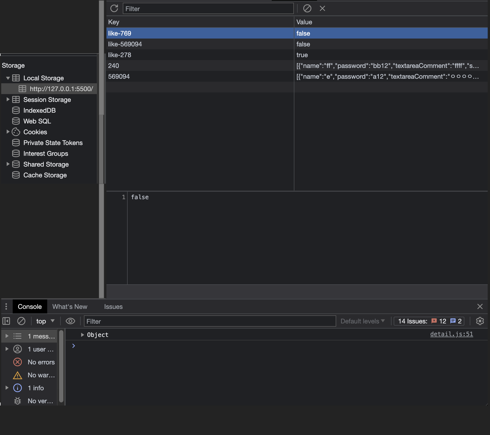

## LocalStorage와 SessionStorage

- Web Storage는 데이터 지속성과 관련하여 두 가지 용도의 저장소를 제공한다.

### LocalStorage

- 사용자 세션 데이터를 유지할 수 있다.

- 브라우저 닫았다가 다시 열어도 데이터가 유지된다.

- 탭을 여러개 열어도 공유된다.

- 명시적으로 삭제될 때까지 지속된다.

- 변경 사항은 저장되어 현재 및 향후 사이트 방문 시 사용할 수 있다.

```js
// 로컬 스토리지에 데이터를 저장한다.
localStorage.setItem(key, value);

// 로컬 스토리지에서 저장된 데이터를 가져온다.
localStorage.getItem(key);

// 로컬 스토리지에서 저장된 데이터를 삭제한다.
localStorage.removeItem(key);

// 로컬 스토리지에 있는 모든 데이터 삭제한다.
localStorage.clear();
```

<br>



### SessionStorage

- 브라우저 세션 기간 동안만 사용할 수 있으며 탭이나 창을 닫으면 삭제된다.

- 새로고침을 해도 유지된다.

- 변경 된 사항은 현재 페이지에서 닫힐 때까지 저장되어 사용할 수 있다.

- 탭이 닫히면 저장된 데이터가 삭제 된다.

```js
// 세션 스토리지에 데이터를 저장한다.
sessionStorage.setItem(key, value);

// 세션 스토리지에서 저장된 데이터를 가져온다.
sessionStorage.getItem(key);

// 세션 스토리지에서 저장된 데이터를 삭제한다.
sessionStorage.removeItem(key);

// 세션 스토리지에 있는 모든 데이터 삭제한다.
sessionStorage.clear();
```

## 출처

- 🔗 https://velog.io/@ejchaid/localstorage-sessionstorage-cookie%EC%9D%98-%EC%B0%A8%EC%9D%B4%EC%A0%90
- 🔗 https://dev-syhy.tistory.com/39

```toc

```
