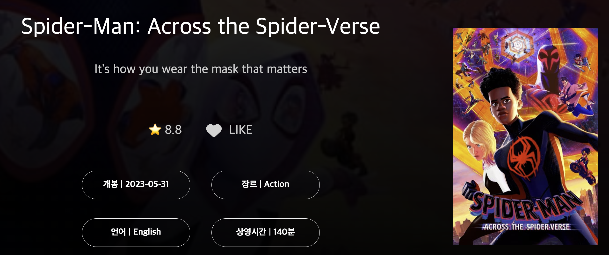

## 구상

- 원하는 영화에 하트를 누르면 버튼이 활성화 되고 메인 페이지 이동하거나 다른 영화를 보고 다시 돌아와도 초기화가 되는 것이 아니라 선택된 그대로 있도록 저장하도록 한다.

## 소스코드

### HTML

- font-awesome 외부 라이브러리를 통해 하트 이미지를 가져온다.

- onclick 함수를 이용해 하트를 선택할 때 활성화가 될 수 있도록 한다.

```html
<link
  rel="stylesheet"
  href="https://cdnjs.cloudflare.com/ajax/libs/font-awesome/6.4.0/css/all.min.css"
/>
<div class="heart">
  <p class="vote"></p>
  <i
    id="btn"
    class="fa-regular fa-heart fa-2xl"
    style="color: lightgray;"
    onclick="heartLight()"
  ></i>
  <p class="like">LIKE</p>
</div>
```

### JS

- 상단에 선언해놓은 id값을 String타입으로 변환 후 localStorage에서 가져온다.

- 조건문을 활용해서 저장된 값이 문자열 true이면 html에서 선언한 버튼 id값에 선택이 되면서 색이 변경이 되면서 저장되고, 페이지 이동시에도 저장되어있어 다시 들어가도 좋아요 버튼이 활성화 된 것을 확인할 수 있다.

- 함수 heartLight를 통해 html에서 하트를 클릭할 때 문자열 참, 거짓 값을 비교해서 버튼 활성화 여부를 판단한다.

```js
const saveId = localStorage.getItem('like-' + String(id));
if (saveId === 'true') {
  const like = document.querySelector('#btn');
  like.classList.add('fa-solid');
}
// 좋아요 기능
function heartLight() {
  const a = localStorage.getItem('like-' + String(id));
  if (a === 'true' || a === 'false') {
    localStorage.setItem('like-' + String(id), !(a === 'true'));
  } else {
    localStorage.setItem('like-' + String(id), true);
  }
  const like = document.querySelector('#btn');
  like.classList.toggle('fa-solid');
  s;
}
```

### CSS

```css
/* 좋아요 버튼 부분 */
.heart {
  height: auto;
  justify-content: center;
  display: flex;
  align-items: center;
  flex-direction: row;
}

#btn {
  cursor: pointer;
  font-size: 2em;
  margin-left: 50px;
  margin-right: 15px;
}
```

## 결과



```toc

```
