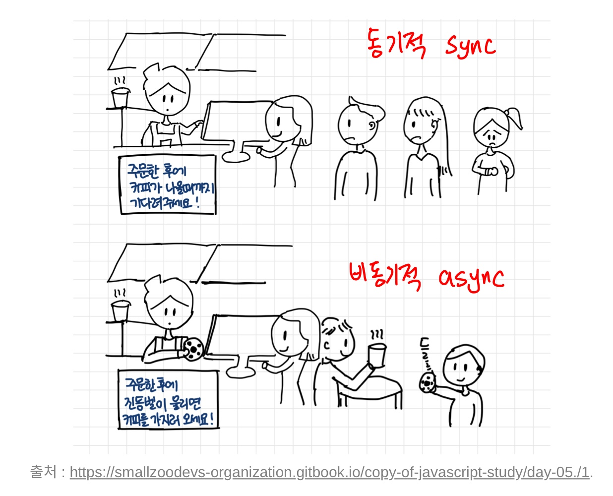

## 동기와 비동기의 개념



### 1. 동기 : sync

- 현재 실행중인 코드가 끝나야 다음 코드를 실행하는 방식

- CPU의 계산에 의해 즉시 처리가 가능한 대부분의 코드는 동기적 코드이다.

- 계산이 복잡해서 CPU가 계산하는 데에 오래 걸리는 코드 역시도 동기적 코드이다.

### 2. 비동기 : async

- 실행 중인 코드의 `완료 여부와 무관하게` <b>즉시</b> 다음 코드로 넘어가는 방식이다.

- setTimeout, addEventListner등이 있다.

- 별도의 <u>요청, 실행 대기, 보류</u>등과 관련된 코드는 모두 비동기적 코드이다.

- `웹의 복잡도`가 올라갈 수록 비동기적 코드의 비중이 늘어난다.

## 콜백 지옥의 예시와 해결방안

- `setTimeout`를 통해 콜백 지옥의 간단한 예시 코드이다.

  ```js
  setTimeout(
    function (name) {
      var coffeeList = name;
      console.log(coffeeList);
      setTimeout(
        function (name) {
          coffeeList += ', ' + name;
          console.log(coffeeList);
          setTimeout(
            function (name) {
              coffeeList += ', ' + name;
              console.log(coffeeList);
              setTimeout(
                function (name) {
                  coffeeList += ', ' + name;
                  console.log(coffeeList);
                },
                500,
                '카페라떼',
              );
            },
            500,
            '카페모카',
          );
        },
        500,
        '아메리카노',
      );
    },
    500,
    '에스프레소',
  );
  ```

    <br>

  ### 해결방안

  ### 1. 기명함수 변환

  ```js
  var coffeeList = '';
  var addEspresso = function (name) {
    coffeeList = name;
    console.log(coffeeList);
    setTimeout(addAmericano, 500, '아메리카노');
  };
  var addAmericano = function (name) {
    coffeeList += ', ' + name;
    console.log(coffeeList);
    setTimeout(addMocha, 500, '카페모카');
  };
  var addMocha = function (name) {
    coffeeList += ', ' + name;
    console.log(coffeeList);
    setTimeout(addLatte, 500, '카페라떼');
  };
  var addLatte = function (name) {
    coffeeList += ', ' + name;
    console.log(coffeeList);
  };

  setTimeout(addEspresso, 500, '에스프레소');
  ```

    <br>

  - 가독성이 좋은 장점이 있지만 한 번만 사용할 코드에 이름을 다 부여한다는것은 비효율적 코드이라서 근본적인 해결책은 아니다.
    자바스크립트에서는 비동기적인 작업을 동기적으로 처리해주는 방법을 계속 마련해주고 있다. `ES6 : Promise, Generator, ES7 : async/await`

    <br>

    <blockquote>

    <h2><font color="red">비동기 작업의 동기적 표현이 필요합니다.</font></h2>

    </blockquote>

    <br>

  ### 비동기 작업의 동기적 표현

  #### 1. Promise (1)

  ✔️ Promise : 비동기 처리에 대해, 처리가 끝나면 알려준다.

  - new 연산자로 호출한 Promise의 인자가 넘어가는 콜백은 `바로 실행`된다.

  - 내부의 `resolve(또는 reject)` 함수를 호출하는 구문이 있을 경우 `resolve(또는 reject)` 둘 중 하나가 실행되기 전까지는 `다음(then), 오류(catch)`로 넘어가지 않는다.

  - 따라서, 비동기작업이 완료될 때 비로소 `resolve, reject` 호출한다.

  #### 2. Promise (2)

  #### 3. Generator

  #### 4. Promise + Async/await

```toc

```
