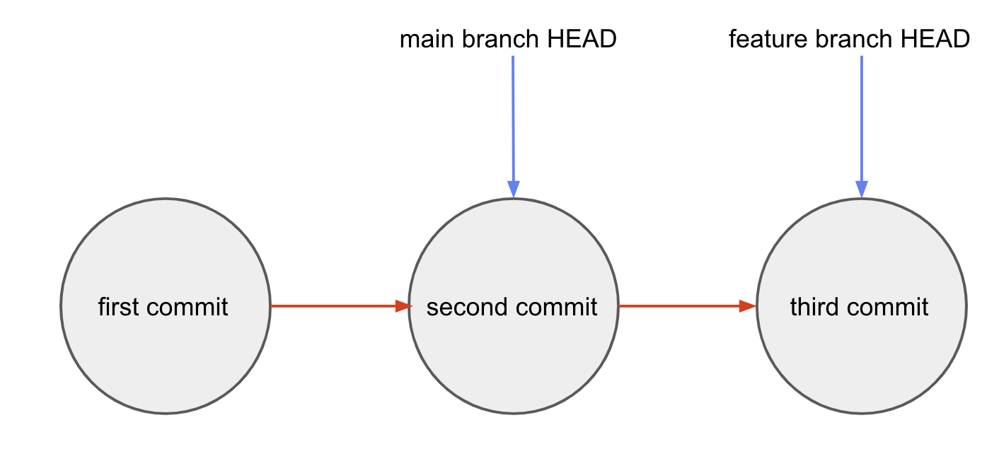
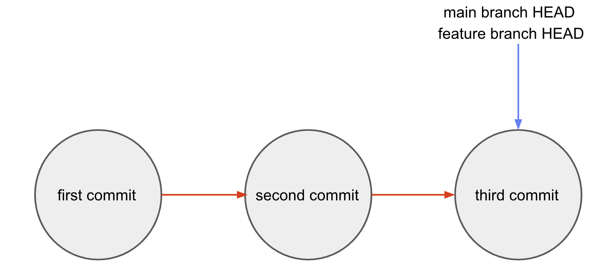
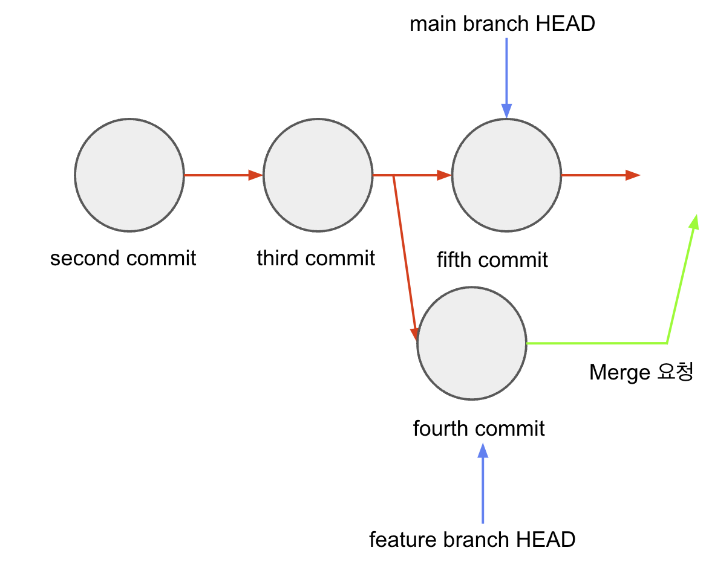
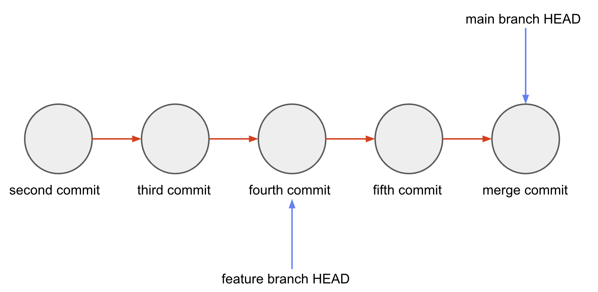

## Git Merge

✔️ git branch를 다른 branch로 합치는 과정이다.

## Fast Forward Merge

✔️ 가장 기본적인 merge는 바로 Fast Forward Merge이다. `Fast Forward Merge`는 `현재 브랜치의 HEAD가 대상 브랜치의 HEAD까지로 옮기는 Merge`이다.

```bash
git switch [현재 브랜치]
git merge [대상 브랜치]
```



✔️ main 브랜치의 HEAD를 feature branch의 HEAD까지 옮기고 싶다면 아래와 같은 과정을 거쳐야한다.

- 1. `git switch main`을 이용해 main 브랜치로 전환한다.

- 2. `git merge feature`를 이용해 main 브랜치의 HEAD를 feature브랜치의 HEAD로 옮긴다.

✔️ main 브랜치의 HEAD가 feature 브랜치의 HEAD인 thrid branch로 옮겨진다.



## Fast Forward Merge의 한계점

✔️ 중간에 변경이 없을 때만 동작한다. 만약 중간에 다른 커밋이 있다면 충돌이 발생해 제대로 동작하지 않는다.

### 해결방안

#### Merge Commit으로 Merge Conflict 제어하기



✔️ fourth commit과 fifth commit이 같은 부분을 수정했을 경우에 main 브랜치와 feature 브랜치 사이에 merge 충돌이 생긴다.

<br>

`merge 시 충돌이 생긴 파일은 git status가 both modified로 변경된다.` 해결하기 위해서는 충돌이 생긴 파일을 해결해야한다.

- 1. 맨 위에 `<<<<<<<<<<<< HEAD`와 구분선 `===========` 사이의 값인 fifth commit은 현재 브랜치인 main 브랜치의 변경 사항이다.

- 2. 구분선인 `===========`과 `>>>>>>>>>>>> [feature]` 사이의 값인 fourth commit은 머지 대상 브랜치인 feature 브랜치의 변경 사항이다.

```js
<<<<<<<< HEAD
[현재 브랜치의 변경 사항]
====================[구분선]
[머지 대상 브랜치의 변경 사항]
>>>>>>>> [대상 브랜치명]
```

- 해결하기 위해서는 `<<<<<<<<`, `===========`, `>>>>>>>>`을 모두 제거해야 변경 사항을 반영된다.
  <br>
  그 후 다시 `git add`,`git commit`를 통해 다시 commit하면 된다.

<b>해결이 끝나면 하기 그림과 같아진다.</b>



## 출처

🔗 https://kotlinworld.com/277

```toc

```
